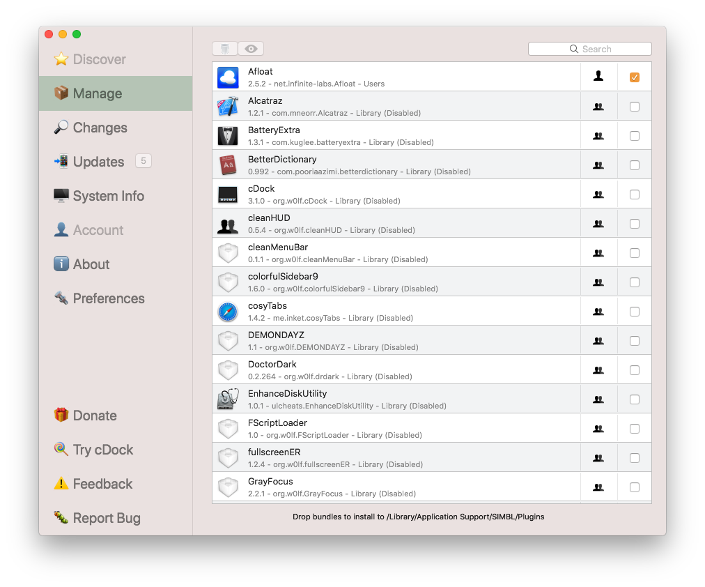

<!---->

## MacForge 

MacForge is an open-source plugin manager for macOS. It lets you discover, install and manage plugins to improve the user experience of macOS without the need for manually cloning/building or copying files.

## [Installation]()

- Download the [*latest **beta** release*](https://github.com/w0lfschild/app_updates/raw/master/MacForge/MacForge.zip)
- Unzip the download if your browser does not do so automatically
- Open MacForge
- MacForge will ask to be moved to /Applications
- MacForge will ask to install or update helper tools
- Disable [System Integrity Protection](https://www.imore.com/how-turn-system-integrity-protection-macos)
- Start installing and using plugins

## Functionallity notes

- Loading plugins into system applications requires that [System Integrity Protection](https://apple.stackexchange.com/questions/208478/how-do-i-disable-system-integrity-protection-sip-aka-rootless-on-os-x-10-11) is disabled
- Loading plugins into some applications may require [Apple Mobile File Integrity](https://www.theiphonewiki.com/wiki/AppleMobileFileIntegrity) to be disabled
- Loading plugins into some applications may require the plugin must be *signed* and in the `/Library` directory

## System Requirements

- MacForge supports macOS 10.11 and above
- Plugins distributed through MacForge may have different application and system requirements

## [Wiki](https://github.com/w0lfschild/MacForge/wiki/Home)

## [Features](https://github.com/w0lfschild/MacForge/wiki/Features)

## [Creating a bundle](https://github.com/w0lfschild/MacForge/wiki/Bundles-:-Creating)

## [Publishing a bundle](https://github.com/w0lfschild/MacForge/wiki/Bundles-:-Publishing)

## [Selling a bundle](https://github.com/w0lfschild/MacForge/wiki/Bundles-:-ASelling)

## Troubleshooting

- Having problems? Submit an issue here: [submit](https://github.com/w0lfschild/MacForge/issues/new)

## [Uninstalling]()

- Trashing `MacForge` will stop it from loading into applications 

## Developement

- [Wolfgang Baird](https://github.com/w0lfschild) ([@w0lfschild](https://github.com/w0lfschild)) ([MacEnhance](https://www.macenhance.com/))
